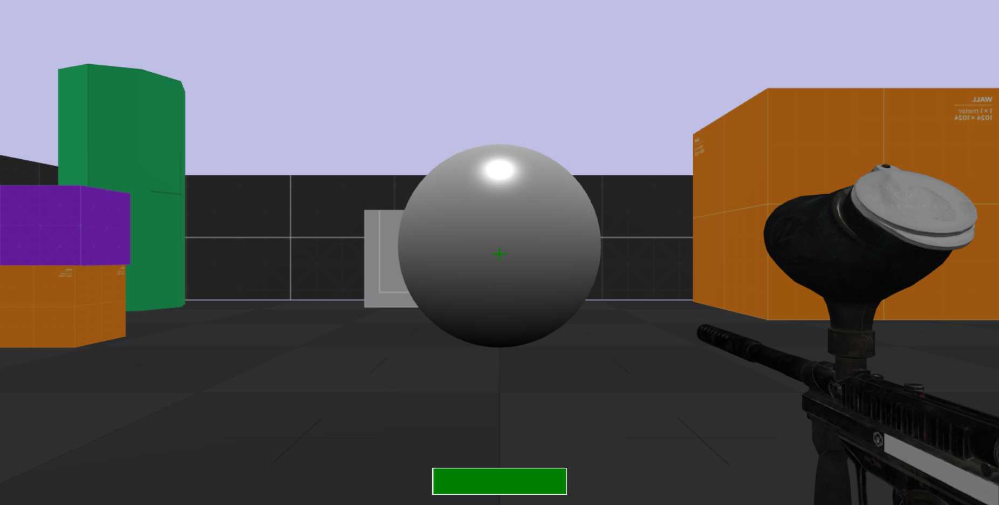
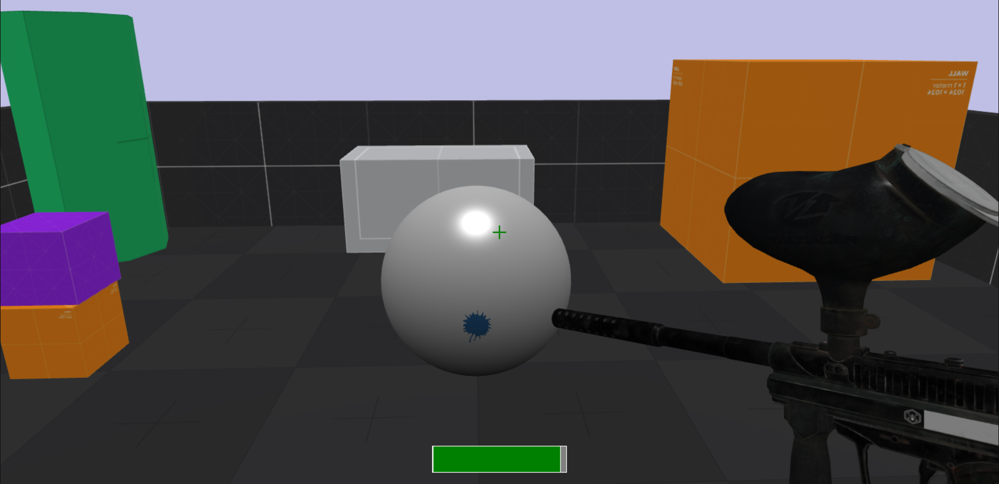
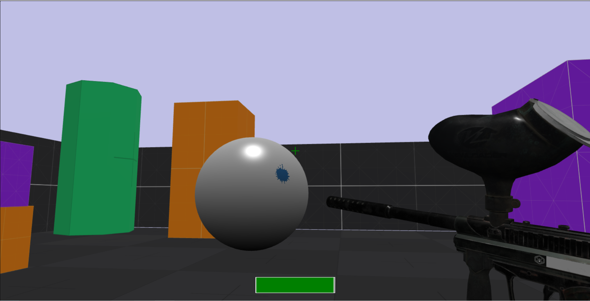
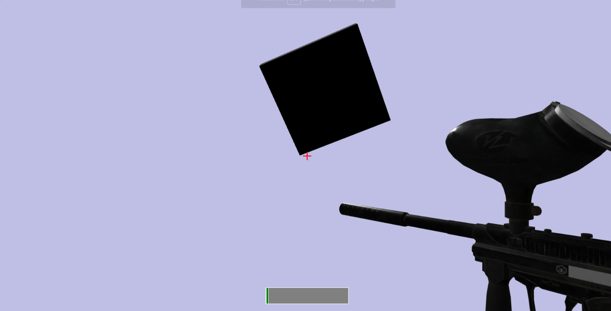

# Задание
### 1. Подключите физический движок к проекту.
### 2. Добавьте объекту на сцене импостор.

## Скриншоты выполненного задания:

Начальное положение камеры:

Вид при прыжке:

Вид при сталкивании со сферой (сфера перекатывается):

Падение:
